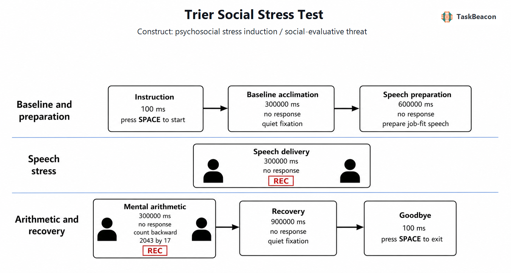

# 特里尔社会应激测验：急性社会评价威胁的实验诱发、心理生物学测量与解释边界

急性心理社会应激研究需要在实验控制、诱发强度与生态关联之间取得平衡。仅增加认知负荷往往能够引起交感神经活动，却未必稳定启动下丘脑—垂体—肾上腺皮质轴（hypothalamic–pituitary–adrenocortical axis, HPA 轴）；过强或不可标准化的情境又会削弱可重复性。特里尔社会应激测验（亦译特里尔社会压力测试；Trier Social Stress Test, TSST）通过公开陈述、困难心算、社会评价威胁与低可控性相结合，为研究急性应激的主观、心血管、内分泌及免疫反应提供了标准化诱发程序。其方法学价值在于产生具有明确起点和恢复期的多系统反应，而非把某一项指标视为应激本身。本文据此讨论 TSST 的操作逻辑、心理生物学证据、主要变式、测量边界及 TaskBeacon 当前实现。

## 1. 范式提出与理论基础

Kirschbaum、Pirke 和 Hellhammer（1993）提出 TSST 时，核心目标是建立一种能在实验室中重复诱发中等强度心理社会应激的程序。原始研究将 10 分钟预期/准备阶段与 10 分钟测验阶段相连，后者由 5 分钟求职陈述和 5 分钟连续心算组成；参与者面对保持中性、不提供支持的评审组，并被告知表现会被记录和评价。六项初期研究中，TSST 引起促肾上腺皮质激素、血清及唾液皮质醇、心率等指标上升，唾液皮质醇常达到基线的约 2–4 倍（Kirschbaum et al., 1993）。后续标准协议进一步规定了评委行为、阶段时长、取样时点与实验后说明，以减少实施者差异（Birkett, 2011）。

TSST 的效力主要来自社会评价威胁与不可控性的叠加。实验室应激元分析显示，可能损害“社会自我”的评价情境，尤其在参与者难以通过行为终止或控制结果时，最易诱发显著 HPA 轴反应和较慢恢复（Dickerson & Kemeny, 2004）。这一判断得到条件操纵的直接支持：当评委给予友好、鼓励性反馈时，参与者仍完成陈述和心算，但健康男女均未出现典型 HPA 轴激活（Wiemers et al., 2013）。因此，心算错误或讲话本身不是充分诱因；中性评价、表现压力、被记录感与低可控性共同界定了范式所测的急性社会评价应激（Frisch et al., 2015）。

## 2. 任务逻辑、流程与核心参数

经典 TSST 通常在正式测验前设置安静适应和基线取样，以降低到达实验室、知情同意或采样操作造成的前置波动。随后，参与者获得求职陈述题目并准备约 10 分钟；正式阶段在两至三名训练过的中性评委面前完成约 5 分钟陈述，再进行约 5 分钟口头连续减法。算错时，评委要求从起始数重新开始；讲话提前中断时，评委以标准化提示要求继续。阶段结束后进入恢复期，并在多个时点重复采集主观紧张、心率/心率变异性、血压、唾液 α-淀粉酶与皮质醇等指标（Birkett, 2011; Allen et al., 2017）。TSST 是一次连续的诱发程序，不宜套用离散认知任务的“正确试次率”概念；其基本分析单位通常是阶段、时间点和反应曲线。

不同阶段对应的心理过程和指标具有可区分的时间尺度。准备期主要包含威胁预期、自我呈现准备与对评价结果的低控制感；陈述期强化社会自我威胁；心算期同时增加认知负荷、失败反馈和不可控性；恢复期则反映各系统回落速度。主观紧张和心率可在准备或任务执行时迅速上升，唾液皮质醇受分泌与扩散延迟影响，峰值通常出现在应激源开始后的较晚时段。故“任务中—基线”的心率差与“任务后峰值—基线”的皮质醇差并非同一潜在过程的可互换指标。推荐同时报告反应曲线、相对于基线的变化、峰值变化、相对于零点的曲线下面积（AUCg）或相对于增加量的曲线下面积（AUCi），并预先规定取样窗口（Allen et al., 2017; Man et al., 2023）。

协议参数会改变观察到的效应。对 186 项研究的元分析表明，实验前适应、基线活动、一天中的测试时间、样本组成及具体实施方式均可造成皮质醇反应的实验室间异质性（Goodman et al., 2017）。另一项元分析进一步发现，陈述主题、性别构成及样本量能够解释相当比例的唾液皮质醇效应差异（Gu et al., 2022）。因此，研究报告应说明陈述主题、评委人数与行为、是否录像、心算规则、错误提示、站立或坐姿、适应时长、测试时段、咖啡因/尼古丁、药物、月经周期及激素避孕等控制信息，而不能只写“采用 TSST”。

## 3. 主要行为与神经科学发现

### 3.1 多系统应激反应

TSST 最稳定的群体效应是负性情绪和唾液皮质醇随时间上升，心率和唾液 α-淀粉酶也常表现出敏感变化。涵盖 61 项健康样本研究的系统综述与元分析显示，唾液皮质醇和负性心境对诱发及恢复最为敏感；心率、α-淀粉酶、脱氢表雄酮、炎症指标和皮肤电的证据强度不一，且生物指标与主观体验之间的相关结果混合（Man et al., 2023）。该结果支持将 TSST 视为多系统扰动，而不支持用单次皮质醇或主观紧张评分概括完整应激反应。

多系统不同步具有实质性的理论含义。交感—肾上腺—髓质系统可在威胁预期和讲话开始后迅速改变心率、血压与电皮肤活动；HPA 轴经历促肾上腺皮质激素释放、肾上腺皮质分泌和唾液扩散，因而皮质醇峰值相对主观紧张与心率反应滞后。恢复期内，心率可能已接近基线，而皮质醇仍处于上升或峰值附近。各指标相关偏低不必然意味着诱发失败，也可能反映反应系统的动力学差异。研究设计若只在任务结束即刻取一次唾液样本，可能低估 HPA 轴反应；只报告峰值则会丢失反应启动和恢复速率的信息（Allen et al., 2017; Man et al., 2023）。

TSST 也具有一定现实关联。实验室 TSST 中的皮质醇和主观应激反应与真实考试情境中的对应反应显著相关，为其生态效度提供了直接证据（Henze et al., 2017）。这种相关不能推导出实验室反应可精确预测个体长期健康结局；日常应激包含持续时间、可逃避性、社会关系和反复暴露等 TSST 无法完全重现的因素。

### 3.2 EEG 与 fMRI 证据

连续脑电图（electroencephalography, EEG）适合追踪 TSST 各阶段内的快速变化。Berretz 等（2022）在 TSST 与非应激对照条件中记录 51 名健康成人的连续 EEG，发现急性应激伴随额区 α 不对称向相对左侧活动增强方向变化。该结果提示社会应激可改变半球功能不对称，但头皮 α 功率同时受言语、运动、姿势和肌电伪迹影响，不能据此定位单一皮层发生源或断言其为 HPA 轴反应的原因。

经典 TSST 的站立陈述和面对面评审难以直接置入磁共振环境。ScanSTRESS、Montreal Imaging Stress Task 等成像变式以时间压力、强制失败和视频评价替代部分原始操作。急性应激 fMRI 研究的激活似然元分析在双侧岛叶、屏状核及额下回发现较一致的条件相关活动，但纳入范式对社会评价、表现压力与运动要求的权重不同（Berretz et al., 2021）。成像结果因此说明分布式显著性、情绪与控制相关网络参与急性应激加工，不能将成像变式的“应激 > 对照”对比等同于经典 TSST 的陈述或心算阶段，也不能由 BOLD 差异单独推断脑区的因果作用（Noack et al., 2019）。

## 4. 范式发展与主要应用

TSST 的扩展主要服务于人群适配和实施标准化。儿童/青少年版本调整陈述内容与算术难度；线上版本则在远程视频会议中保留实时评委和社会评价。对 15–16 岁青少年的验证研究表明，完全远程的 TSST-Online 能诱发主观和生理应激反应，为无法面对面采集时提供可行方案（Gunnar et al., 2021）。虚拟现实版本以可重复的虚拟评委降低人力和评委行为差异。传统与虚拟 TSST 的元分析显示，两类环境均能引起心血管、皮质醇和自评反应，但媒介临场感、评委反应真实性及设备不适会改变效应，二者不应被预设为完全等价（Helminen et al., 2021）。近期半虚拟方案进一步尝试在减少现场人员需求的同时保留实验室控制（Miller et al., 2025）。

这些变式改变的不只是呈现媒介，还可能改变社会关系结构。面对面版本中，评委能够根据沉默、错误或提前结束进行标准化干预；预录虚拟评委通常不能对参与者表现做出真正偶联的反应；远程实时评委保留互动偶联，却引入网络延迟、居家环境和隐私控制差异。儿童版本还需使题目在年龄上可理解，同时维持失败概率而不造成羞辱。变式验证因而应至少同时检验主观威胁、快速自主神经反应和延迟内分泌反应，并与含相同言语、算术和媒介负荷的对照条件比较，而不能仅以“任务完成”判定构念等价。

临床研究利用 TSST 比较应激反应曲线，而非进行诊断。跨精神障碍元分析发现，当前重性抑郁或焦虑障碍女性较多表现为皮质醇反应减弱，而当前重性抑郁或社交焦虑男性可表现为增强；精神分裂症结果倾向减弱，但研究数量少且存在发表偏倚（Zorn et al., 2017）。性别、症状状态、用药和既往应激暴露能够改变组间方向，说明“高反应”与“低反应”均非跨疾病的固定标志。TSST 适合检验预先提出的组别、干预或调节效应，不宜将单次反应分类为个体疾病风险。

## 5. 信度、效度与解释边界

TSST 对健康样本产生群体平均反应的效度较充分，个体差异指标的信度则依赖计算方式。相隔 4 个月重复实施时，AUCg 在多种内分泌和主观指标中的重测相关为 .606–.858，而 AUCi 和相对峰值变化的相关范围为 −.146–.548；第二次暴露的主观恢复也更快（Kexel et al., 2021）。这表明稳定的群体诱发效应并不保证“反应者排序”稳定。纵向设计应预先选择指标、控制采样时刻，并考虑熟悉化和习惯化；若目标是个体预测，单次差值通常不足。

构念效度还取决于对照条件。无评委的心算对照同时移除了社会评价、录像提示和错误纠正，所得差异是复合效应；友好评委对照保留社会互动，却改变评价效价和支持感。研究问题若聚焦社会评价威胁，应尽量保持认知负荷与言语活动一致。若聚焦整体急性应激后效，则需考虑皮质醇相对任务阶段的时间滞后。性别、年龄、体重、药物、测试时段、睡眠和早期逆境等因素既可能是真实调节变量，也可能在小样本中形成混杂（Goodman et al., 2017; Gu et al., 2022）。因此，TSST 的主要优势是可控制地诱发急性心理社会应激；其结果不等同于慢性应激、现实创伤或个体临床诊断。

实施质量与伦理程序也直接影响可解释性。评委的语气、目光、追问频率和错误纠正必须训练并保持一致，实验者不应在不同条件中无意提供支持。预注册应界定排除标准、皮质醇无反应的处理、异常值规则及主要时间窗，避免看到曲线后选择最显著指标。由于范式有意制造社会威胁与失败体验，研究方案还需设置风险筛查、随时退出、应激后恢复观察和充分说明；这些保护措施不削弱范式效度，但不应在应激阶段提前消除被评价感。对于心血管或内分泌风险较高的人群，纳入标准和医学监测须由具体伦理与临床方案确定。

## 6. TaskBeacon 中的任务实现

### 6.1 任务资源与访问入口

| 资源 | ID | 用途 | 地址 |
|---|---|---|---|
| 完整任务仓库 | T000042 | 中文 PsychoPy/PsyFlow 行为实验实现 | [GitHub](https://github.com/TaskBeacon/T000042-trier-social-stress-test) |
| 浏览器伴随仓库 | H000042 | 中文浏览器行为版源代码 | [GitHub](https://github.com/TaskBeacon/H000042-trier-social-stress-test) |
| 在线运行入口 | H000042 | 浏览器体验与行为流程预览 | [PsyFlow Web](https://taskbeacon.github.io/psyflow-web/?task=H000042-trier-social-stress-test) |

T000042 是当前本地完整行为实现；H000042 保留相同阶段和完整时长，但输出字段较少，适合作为浏览器伴随版。两者均以屏幕图形呈现评委和录制提示。浏览器运行不能替代真人评委管理、生理采样、实际音视频记录或临床采集程序。

### 6.2 实现流程与关键参数

**图 1. TaskBeacon 当前版本的 TSST 流程。**参与者按空格进入单一区组、单一 `tsst` 条件：先安静注视 300 秒，再在两名屏幕评委、红色录制灯与 `REC` 标记前准备“为何适合该工作”的陈述 600 秒；随后连续陈述 300 秒，并从 2043 起每次减 17、出错后从头开始，持续 300 秒；最后安静注视恢复 900 秒并按空格退出。正式定时阶段不采集按键反应，无积分、奖惩或自适应调节。仓库按阶段记录实际经过时间、阶段顺序与总时长。

| 要素 | TaskBeacon 当前设置 | 方法学含义 |
|---|---|---|
| 结构 | 1 区组、1 次连续程序、单一 `tsst` 条件 | 主要比较来自阶段与外部生理/主观测量时间点，而非试次条件 |
| 时长 | 基线 5 分钟；准备 10 分钟；陈述 5 分钟；心算 5 分钟；恢复 15 分钟 | 覆盖快速自主神经反应及较迟的皮质醇峰值/恢复窗口 |
| 社会评价呈现 | 两名静态屏幕评委、录制灯和 `REC` 标签 | 提供标准化评价线索；现有文件无法确认真人实时评价或实际录音 |
| 反应与反馈 | 仅开始/退出使用空格；心算规则由文字提示，程序不采集口头答案 | 无法由任务输出计算讲话持续性、算术正确率或错误纠正频率 |
| 评分与自适应 | 无积分、无奖励、无阶梯 | 任务目标是应激诱发，不产生绩效学习指标 |
| 采集方式 | 中文行为程序，记录各阶段耗时和总耗时 | 皮质醇、心电、皮肤电及主观量表需由外部研究方案同步采集 |

该实现保留经典 TSST 的准备—陈述—心算—恢复次序及主要时长，并将评委场景标准化为屏幕刺激。它也提前告知完整流程，且程序本身不实施实时负性评价、口头表现记录或错误纠正；这些操作会降低或改变不可控性与社会评价威胁。研究者若用其检验 HPA 轴或临床组差异，应在方案中明确是否另设真人评委、实际录像、标准化提示及生理取样，并将这些附加操作作为可复现方法报告。仅运行当前屏幕版时，更审慎的表述是“含社会评价线索的 TSST 结构化行为脚本”，不宜默认其诱发强度与经典面对面 TSST 等同。

## 参考文献

Allen, A. P., Kennedy, P. J., Dockray, S., Cryan, J. F., Dinan, T. G., & Clarke, G. (2017). The Trier Social Stress Test: Principles and practice. *Neurobiology of Stress, 6*, 113–126. https://doi.org/10.1016/j.ynstr.2016.11.001

Berretz, G., Packheiser, J., Kumsta, R., Wolf, O. T., & Ocklenburg, S. (2021). The brain under stress—A systematic review and activation likelihood estimation meta-analysis of changes in BOLD signal associated with acute stress exposure. *Neuroscience & Biobehavioral Reviews, 124*, 89–99. https://doi.org/10.1016/j.neubiorev.2021.01.001

Berretz, G., Packheiser, J., Wolf, O. T., & Ocklenburg, S. (2022). Acute stress increases left hemispheric activity measured via changes in frontal alpha asymmetries. *iScience, 25*(2), 103841. https://doi.org/10.1016/j.isci.2022.103841

Birkett, M. A. (2011). The Trier Social Stress Test protocol for inducing psychological stress. *Journal of Visualized Experiments*, (56), e3238. https://doi.org/10.3791/3238

Dickerson, S. S., & Kemeny, M. E. (2004). Acute stressors and cortisol responses: A theoretical integration and synthesis of laboratory research. *Psychological Bulletin, 130*(3), 355–391. https://doi.org/10.1037/0033-2909.130.3.355

Frisch, J. U., Häusser, J. A., & Mojzisch, A. (2015). The Trier Social Stress Test as a paradigm to study how people respond to threat in social interactions. *Frontiers in Psychology, 6*, 14. https://doi.org/10.3389/fpsyg.2015.00014

Goodman, W. K., Janson, J., & Wolf, J. M. (2017). Meta-analytical assessment of the effects of protocol variations on cortisol responses to the Trier Social Stress Test. *Psychoneuroendocrinology, 80*, 26–35. https://doi.org/10.1016/j.psyneuen.2017.02.030

Gu, H., Ma, X., Zhao, J., & Liu, C. (2022). A meta-analysis of salivary cortisol responses in the Trier Social Stress Test to evaluate the effects of speech topics, sex, and sample size. *Comprehensive Psychoneuroendocrinology, 10*, 100125. https://doi.org/10.1016/j.cpnec.2022.100125

Gunnar, M. R., Reid, B. M., Donzella, B., Miller, Z. R., Gardow, S., Tsakonas, N. C., Thomas, K. M., DeJoseph, M., & Bendezú, J. J. (2021). Validation of an online version of the Trier Social Stress Test in a study of adolescents. *Psychoneuroendocrinology, 125*, 105111. https://doi.org/10.1016/j.psyneuen.2020.105111

Helminen, E. C., Morton, M. L., Wang, Q., & Felver, J. C. (2021). Stress reactivity to the Trier Social Stress Test in traditional and virtual environments: A meta-analytic comparison. *Psychosomatic Medicine, 83*(3), 200–211. https://doi.org/10.1097/PSY.0000000000000918

Henze, G.-I., Zänkert, S., Urschler, D. F., Hiltl, T. J., Kudielka, B. M., Pruessner, J. C., & Wüst, S. (2017). Testing the ecological validity of the Trier Social Stress Test: Association with real-life exam stress. *Psychoneuroendocrinology, 75*, 52–55. https://doi.org/10.1016/j.psyneuen.2016.10.002

Kexel, A.-K., Kluwe-Schiavon, B., Visentini, M., Soravia, L. M., Kirschbaum, C., & Quednow, B. B. (2021). Stability and test-retest reliability of different hormonal stress markers upon exposure to psychosocial stress at a 4-month interval. *Psychoneuroendocrinology, 132*, 105342. https://doi.org/10.1016/j.psyneuen.2021.105342

Kirschbaum, C., Pirke, K.-M., & Hellhammer, D. H. (1993). The ‘Trier Social Stress Test’—A tool for investigating psychobiological stress responses in a laboratory setting. *Neuropsychobiology, 28*(1–2), 76–81. https://doi.org/10.1159/000119004

Man, I. S. C., Shao, R., Hou, W. K., Li, S. X., Liu, F. Y., Lee, M., Wing, Y. K., Yau, S.-Y., & Lee, T. M. C. (2023). Multi-systemic evaluation of biological and emotional responses to the Trier Social Stress Test: A meta-analysis and systematic review. *Frontiers in Neuroendocrinology, 68*, 101050. https://doi.org/10.1016/j.yfrne.2022.101050

Miller, M., Divine, M., McAfee, C., Brown, R., Sears, S., Krautkramer, C., Gogia, R., Josephs, R. A., & Champagne, F. A. (2025). A semi-virtual Trier Social Stress Test (SV-TSST). *Psychoneuroendocrinology, 172*, 107267. https://doi.org/10.1016/j.psyneuen.2024.107267

Noack, H., Nolte, L., Nieratschker, V., Habel, U., & Derntl, B. (2019). Imaging stress: An overview of stress induction methods in the MR scanner. *Journal of Neural Transmission, 126*(9), 1187–1202. https://doi.org/10.1007/s00702-018-01965-y

Wiemers, U. S., Schoofs, D., & Wolf, O. T. (2013). A friendly version of the Trier Social Stress Test does not activate the HPA axis in healthy men and women. *Stress, 16*(2), 254–260. https://doi.org/10.3109/10253890.2012.714427

Zorn, J. V., Schür, R. R., Boks, M. P., Kahn, R. S., Joëls, M., & Vinkers, C. H. (2017). Cortisol stress reactivity across psychiatric disorders: A systematic review and meta-analysis. *Psychoneuroendocrinology, 77*, 25–36. https://doi.org/10.1016/j.psyneuen.2016.11.036
